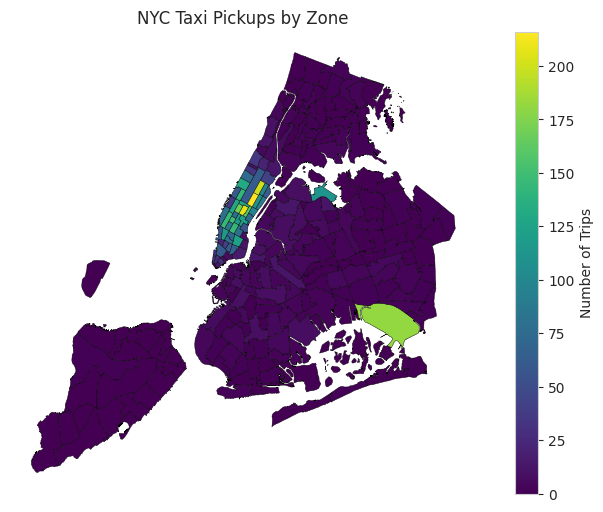
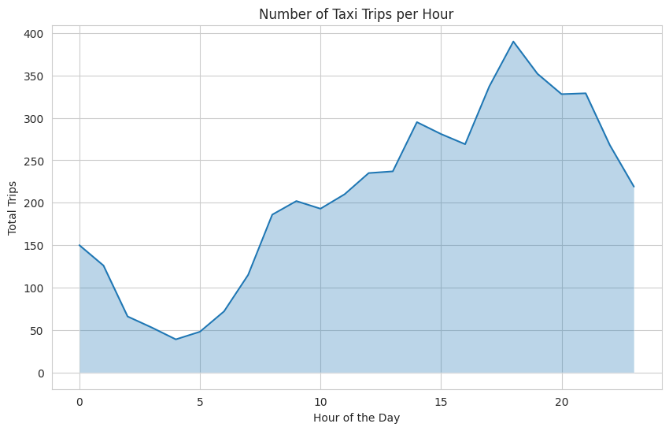
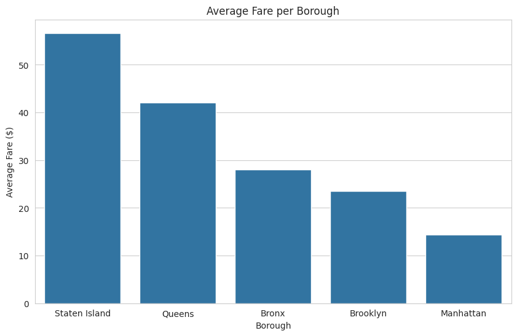
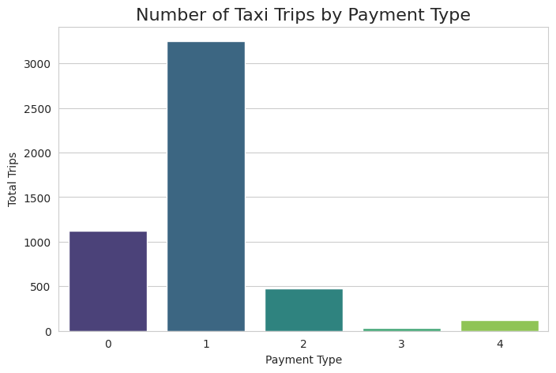

# 🚖 NYC Taxi Data Analysis

## 🎯 Objective
Analyze NYC taxi trip data to identify demand patterns, pricing behavior, and urban mobility trends.  
The goal is to transform raw data into actionable insights that support data-driven decision making.

---

## 📁 Dataset
The dataset contains approximately 5,000 NYC Yellow Taxi trips, including:

- Pickup and dropoff timestamps  
- Passenger count  
- Trip distance  
- Fare and total amount  
- Pickup and dropoff locations  

A taxi zone shapefile was also used for geospatial analysis.

---

## 🛠️ Tools & Technologies

- Python (Pandas, NumPy)  
- Matplotlib & Seaborn  
- GeoPandas  
- Jupyter Notebook  

---

## 🔍 Process

### 1. Data Cleaning
- Removed missing and inconsistent values  
- Filtered unrealistic values (negative fares/distances)  

### 2. Feature Engineering
- Extracted pickup hour and date  
- Prepared dataset for time-based analysis  

### 3. Exploratory Data Analysis (EDA)
- Demand trends over time  
- Geographic distribution of trips  
- Fare and pricing patterns  

---

## 📊 Visualizations

### 🗺️ Taxi Pickups by Zone

### 📈 Demand by Hour

### 💰 Average Fare by Borough

### 💳 Trips by Payment Type

---

## 📈 Key Insights

- Peak demand occurs during commuting hours  
- Taxi activity is concentrated in key urban zones  
- Fare values vary depending on location  
- Data inconsistencies highlight the importance of preprocessing  

---

## 💼 Business Impact

This analysis can support:

- Optimizing fleet allocation based on demand  
- Improving service coverage in high-demand areas  
- Supporting pricing and operational strategies  
- Identifying inefficiencies and optimization opportunities  

---

## 📓 Notebook

You can view the full analysis here:

[Open Notebook](notebooks/nyc_taxi_analysis.ipynb)

🔗 Kaggle Version:  
https://www.kaggle.com/code/gabrieloliveira01/nyc-yellow-taxi-trips-analysis-march-2025

---

## 🚀 Conclusion

This project demonstrates how structured data analysis can transform raw data into valuable insights that support real-world decision making.

Future improvements may include:
- Larger datasets  
- Predictive modeling  
- Integration with external mobility data  

---

## 👤 Author

Gabriel Oliveira  
📊 Data Analyst  
🔗 LinkedIn: https://www.linkedin.com/in/gabrieloliveiraa01  
🔗 Kaggle: https://www.kaggle.com/gabrieloliveira01
